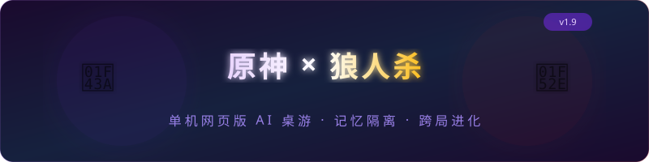
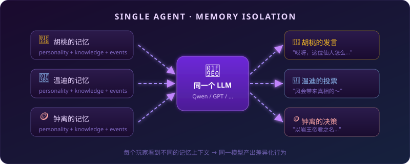

<p align="center">
  
</p>

<p align="center">
  <strong>🐺 你扮演「旅行者」，为提瓦特的伙伴们带去了一款全新的桌面游戏。<br/>别小瞧了这些朋友们，他们学得很快哦~ 🔮</strong>
</p>

<p align="center">
  
  
  
  
  
</p>

---

## 🚀 快速开始

### 📋 前置要求

- Python 3.13+、Node.js 18+、[UV](https://docs.astral.sh/uv/)
- API Key（OpenRouter / ModelScope / OpenAI 任选其一）

### 1️⃣ 配置 API Key

在项目根目录创建 `.env.local`：

```bash
# 三选一

# OpenRouter（推荐，便宜且模型丰富）
LLM_PROVIDER=openrouter
OPENROUTER_API_KEY=sk-or-...
LLM_MODEL=google/gemini-3-flash-preview    # 推荐

# ModelScope（国内免梯）
LLM_PROVIDER=modelscope
MODELSCOPE_API_KEY=sk-...
LLM_MODEL=Qwen/Qwen3-32B                  # 推荐 ≥32B

# OpenAI
LLM_PROVIDER=openai
OPENAI_API_KEY=sk-...
```

### 2️⃣ 启动

#### 本地开发

```bash
git clone https://github.com/tang0389/genshin-night.git
cd genshin-night

uv sync
cd frontend && npm install && npm run build && cd ..
uvicorn backend.app:app --host 0.0.0.0 --port 8000
```

#### Docker

```bash
docker build -t genshin-night .
docker run -d -p 8000:8000 --env-file .env.local genshin-night
```

#### Render 一键部署

项目包含 `render.yaml`，连接仓库后在 Render Dashboard 的 Environment 中配置 API Key 即可部署。

---

打开浏览器访问 `http://localhost:8000`。

> 💡 前端打包进后端静态文件服务，只需一个端口。

### 4️⃣ 开始游戏

1. 🏠 进入大厅，创建或加入一间房间（想一个人单打就自己开房，想联机就把房间号发给朋友）
2. 🎭 选择模式（女巫局 / 猎人局 / 守卫局）和你想要的角色
3. 🌙 进入夜晚 → 按角色行动（狼人杀人 / 预言家查验 / 女巫用药 / 守卫守护）
4. ☀️ 天亮 → 听 AI 发言 → 轮到你发言 → 全体投票
5. 🔄 循环，直到一方阵营胜利

---

## 🎮 游戏模式

| 模式 | 阵容 (6人) |
|------|-----------|
| 🧙 **女巫局** | 狼人×2 + 预言家 + 女巫 + 村民×2 |
| 🏹 **猎人局** | 狼人×2 + 预言家 + 猎人 + 村民×2 |
| 🛡️ **守卫局** | 狼人×2 + 预言家 + 守卫 + 村民×2 |

### 🎯 胜利条件
**好人阵营**：成功放逐所有狼人即为获胜。 \
**狼人阵营**：存活狼人数量达到或超过好人人数即为获胜。

---

## 🌟 AI 角色阵容

每局随机从 10 名原神角色中选出 4–5 名担任你的对手/队友（具体数量取决于真人玩家人数）：

<table>
<tr>
<td align="center"><br/><b>胡桃</b><br/><sub>🌸 鬼马少女<br/>黑色幽默</sub></td>
<td align="center"><br/><b>班尼特</b><br/><sub>🔥 乐观倒霉蛋<br/>热血直球</sub></td>
<td align="center"><br/><b>行秋</b><br/><sub>🖋️ 书生谋士<br/>逻辑缜密</sub></td>
<td align="center"><br/><b>温迪</b><br/><sub>🎵 吟游诗人<br/>爱打哑谜</sub></td>
<td align="center"><br/><b>万叶</b><br/><sub>🍃 沉默武士<br/>偶尔俳句</sub></td>
</tr>
<tr>
<td align="center"><br/><b>菲谢尔</b><br/><sub>⚡ 断罪之皇女<br/>中二调查员</sub></td>
<td align="center"><br/><b>重云</b><br/><sub>❄️ 严肃驱邪师<br/>只讲事实</sub></td>
<td align="center"><br/><b>钟离</b><br/><sub>🪙 博学长者<br/>历史典故</sub></td>
<td align="center"><br/><b>香菱</b><br/><sub>🍳 热情厨娘<br/>做菜比喻</sub></td>
<td align="center"><br/><b>芭芭拉</b><br/><sub>💧 元气偶像<br/>正能量满满</sub></td>
</tr>
</table>

> 每个角色都有完整的性格模板，影响他们的发言风格、推理倾向和社交策略。

---

## 🧠 核心设计

<p align="center">
  
</p>

### 🎯 单 Agent + 记忆隔离

本项目的核心理念：**一个 LLM 实例驱动所有 AI 玩家**。差异化不靠多模型或 fine-tuning，而是靠 **记忆隔离** —— 每次调用前只加载该玩家自己的记忆上下文，好人阵营与狼人阵营各自看到完全不同的信息。

### 📦 三层记忆 + 两个共享区

每个 AI 玩家拥有三层记忆（个性档案 → 角色知识 → 事件记录），从静态人设到动态博弈层层递进。狼人阵营额外共享团队策略区，好人阵营则完全不可见——**不加载 = 不知道**，从根本上解决信息隔离问题。

### 🔄 局内学习：Reflection Pipeline

每轮结束后，存活 AI 自动运行 Generator → Reflector → Curator 三步反思。采用**增量 delta 更新**（受 [ACE](https://arxiv.org/abs/2510.04618) 论文启发），而非让 LLM 重写整个知识文件。每条策略带有效用追踪——有效策略权重上升，无效策略自动衰减。

### 📈 跨局进化：PlayerProfiler

基于 SQLite 的人类玩家行为画像系统。每局结束后，自动分析旅行者（人类玩家）的发言、投票和夜间行为，按胜/负、合作/对抗视角分类存入数据库（受 [ReasoningBank](https://arxiv.org/abs/2509.25140) 论文启发），并通过无训练 RL 动态衰减或强化历史记录。AI 回合时按角色和阶段选择性加载相关观察——**为每一位旅行者量身打造**。

---

## 🛠️ 技术栈

| 层 | 技术 |
|----|------|
| ⚙️ **后端** | Python 3.13 · FastAPI · Uvicorn · Pydantic v2 |
| 🖥️ **前端** | React 19 · TypeScript · Vite 5 · Tailwind CSS 4 · shadcn/ui · Zustand |
| 🤖 **AI** | OpenAI-compatible API（OpenRouter / ModelScope / OpenAI） |

## 📁 项目结构

```
genshin-night/
├── backend/
│   ├── ai/              # 单 Agent + Prompt 组装 + 性格系统
│   ├── game/            # 游戏状态机 + 角色能力 + 胜利判定
│   ├── memory/          # 记忆系统（隔离、反思、玩家画像）
│   ├── models/          # Pydantic 数据模型
│   ├── config/          # 游戏模式配置
│   ├── assets/          # 角色攻略 Playbook
│   ├── app.py           # FastAPI 入口
│   └── prefetch.py      # 异步 LLM 预计算
├── frontend/            # React 19 + TypeScript + Zustand
├── tests/               # 测试
├── Dockerfile           # Docker 一体化构建
├── render.yaml          # Render 部署配置
└── assets/              # README 资源
```

## 🧪 测试

```bash
# 运行全部测试
pytest tests/

# 运行单个测试文件
pytest tests/test_reflection.py
pytest tests/test_player_profiler.py

# 运行单个测试函数
pytest tests/test_api.py::test_root
```

---

## 📝 更新日志

<details open>
<summary><b>v2.3.0</b> (2026-04-20) — 👥 多人房间模式</summary>

- ✅ 支持双人联机：8 间独立房间，每间容纳 1-2 名真人玩家（其余由 AI 补齐到 6 人局）
- ✅ 双人局随机分配「旅行者·空」与「旅行者·荧」两位身份，避免 AI 把你俩混为一人
- ✅ 匿名登录，自动生成昵称（如 `Traveler_abcd`），可随时修改
- ✅ 偏好身份对其他玩家保密，开局按偏好优先分配
- ✅ 房主负责选模式和开始游戏；离开后房主自动移交给下一位
- ✅ 关键节点（进入夜晚/白天、投票、狼人击杀）需要全员确认才推进
- ✅ 投票盲投，只显示进度计数，不泄露谁投了谁
- ✅ 一局结束后「返回房间」即可开启新局，保留偏好身份
</details>

<details>
<summary><b>v2.2.0</b> (2026-03-26) — 🔒 安全与稳定性</summary>

- ✅ 部署安全加固：静态资源路径遍历修复、CORS 策略收紧到可信来源
- ✅ AI 回复更稳：加强了 LLM JSON 输出解析，遇到格式异常能自动修复而不是报错
- ✅ 更好的自动化测试覆盖，保证回归不出错

> 历史说明：v2.2.0 原定引入的"双人房间系统"最终被 v2.3.0 重写替换，本条目仅保留实际进入主线的安全与测试改进。
</details>

<details>
<summary><b>v2.1.0</b> (2026-02-17) — 🚀 Docker 部署</summary>

- ✅ Docker 一体化打包（`Dockerfile` + `render.yaml`），支持 Render 一键部署
- ✅ 每个账号的游戏记忆单独存储，互不干扰
</details>

<details>
<summary><b>v2.0.0</b> (2026-02-16) — ⚡ 流畅度提升</summary>

- ✅ 后台预计算：AI 会趁你思考的间隙提前想好下一步（夜间行动、白天发言、投票），你操作完几乎无需等待
- ✅ 完整结算体验：哪怕游戏已经分出胜负，死亡玩家也能完整看完 夜晚→天亮→投票 的剧情过渡
- ✅ 首页重设计：原神主题着陆页 + 角色轮播动画
- ✅ 夜间身份保护：神职在自己行动阶段之外会被 UI 隐藏；猎人身份仅在实际开枪时揭示
- 🐛 修复 AI 复盘偶尔编造投票结果的问题
</details>

<details>
<summary><b>v1.9.0</b> (2026-02-16) — 🛡️ 守卫角色 + 猎人压枪</summary>

- ✅ 新增守卫局模式（`classic_6_guard`）：守卫夜间守护一名玩家，不能连续守护同一人
- ✅ 守卫 AI 决策 + 前端 NIGHT_GUARD 阶段面板
- ✅ 猎人支持「压枪」（不开枪），夜杀/投票淘汰后自动触发 HUNTER_SHOOT 阶段
- ✅ Prompt 模式感知：平安夜提示、神职标签根据游戏模式动态生成
- ✅ 预言家查验结果统一为「好人」阵营标识
- ✅ 开局记忆上次模式和角色选择
- 🐛 修复投票截断和 RL 跨局强化触发问题
</details>

<details>
<summary><b>v1.8.0</b> (2026-02-16) — 🎯 PlayerProfiler RL 精准化 + UI 打磨</summary>

- ✅ RL 精准强化：仅对本局人类实际角色的观察执行 reward/penalty，衰减与强化互斥
- ✅ 慢衰减：观察存活期从 ~7 局延长到 ~17 局
- ✅ AI 表情贴纸：发言时 LLM 选择角色专属 emoji 贴纸，气泡弹出动画
- ✅ 白天过渡动画优化 + 投票/弃权按钮合并
</details>

<details>
<summary><b>v1.7.0</b> (2026-02-16) — 🎬 流式发言 + 聊天动画 + 角色猜测</summary>

- ✅ 流式 AI 发言：后端 asyncio 后台任务生成，前端轮询实时拉取
- ✅ 聊天气泡动画：打字指示器 → 打字机逐字显示 → 间隔排队
- ✅ 全屏阶段过渡动画：月亮星空（夜晚）/ 太阳光芒（白天）
- ✅ 角色猜测系统：点击玩家卡片标记疑似角色，预言家确认后锁定
</details>

<details>
<summary><b>v1.6.0</b> (2026-02-15) — 🧠 PlayerProfiler 玩家行为画像系统</summary>

- ✅ 全新跨局学习系统 `PlayerProfiler`：SQLite 持久化，从"AI 学 AI"转为"AI 学人类"
- ✅ 胜负视角分类矩阵：同一行为对不同阵营生成不同视角的观察
- ✅ 增量更新 + 选择性 RAG 加载：按 AI 角色+游戏阶段过滤相关观察注入 prompt
- ✅ 自动生命周期：未被强化的观察逐步衰减，约 10 局后自然消亡
- 🐛 修复胜利条件判定
</details>

<details>
<summary><b>v1.5.0</b> (2026-02-15) — 🎭 角色考据 + 模式隔离 + 胜利徽章</summary>

- ✅ 角色台词考据：10 名角色全部替换为原版中文语音台词 + Few-shot 示例重写
- ✅ 胜利皇冠徽章：获胜方头像显示金色皇冠
- ✅ 游戏模式规则隔离：各模式只注入对应规则，杜绝跨模式信息泄露
- 🐛 修复投票截断 + 投票 Prompt 中狼人专属提示仅对狼人可见
</details>

<details>
<summary><b>v1.4.0</b> (2026-02-14) — 🌐 全面中文化 + 体验打磨</summary>

- ✅ UI 全面中文化：事件消息、角色标签、阶段名称
- ✅ 游戏日志跳转定位 + 高亮
- ✅ 狼人夜间商讨系统 + 标签式格式（`【击杀建议】`/`【白天计划】`/`【对你说】`）
- ✅ 已死亡玩家保护：夜间击杀/投票提交时校验目标存活状态
- ✅ LLM 输出清洗增强：自动剥离字段名回显前缀和 markdown 格式
- 🐛 修复 `day_record` 缺失 + 阶段指示器显示英文
</details>

<details>
<summary><b>v1.3.0</b> (2026-02-14) — 🧠 记忆系统大升级</summary>

- ✅ Reflection Pipeline（Generator → Reflector → Curator）
- ✅ 角色攻略 Playbook 注入（静态知识，零 LLM 成本）
- ✅ EventIndex 事件索引（关键事实不受滑动窗口限制）
- ✅ StrategyTracker 策略效用追踪
- ~~ReasoningBank 跨局学习（已移除，由 PlayerProfiler 替代）~~
- 🐛 修复预言家查验结果写入 bug
</details>

<details>
<summary><b>v1.2.0</b> (2026-02-12) — 🐛 Bug 修复 + 体验优化</summary>

- ✅ 「再来一局」按钮 + 开局支持选择身份
- ✅ 白天讨论发言顺序随机化
- 🐛 修复胜利判定显示错误、阵营名称、夜晚死亡后胜利检查
</details>

<details>
<summary><b>v1.1.0</b> (2026-02-12) — 🎨 哥特暗色主题</summary>

- ✅ 前端暗色主题（深紫 + 血红 + 大气光效）
- ✅ 集成 shadcn/ui + Cinzel 哥特字体 + 角色专属配色
- ✅ 全屏胜利弹窗 + 前端打包进后端单端口部署
</details>

<details>
<summary><b>v1.0.0</b> (2026-02-11) — 🎉 初始发布</summary>

- ✅ 三层记忆系统 + 记忆隔离
- ✅ 统一 AI Agent 系统
- ✅ 前后端完整实现
- ✅ 两种游戏模式（女巫局 / 猎人局）
</details>

---

## ⚠️ 免责声明

### 🤖 模型兼容性

游戏核心依赖 LLM 的 **结构化输出** 和 **角色扮演推理** 能力。

> 💡 推荐使用 Gemini 3 Flash Preview 或同等级以上的模型以获得最佳体验。

### 🎨 素材版权声明

本项目中使用的所有**原神角色名称、人设、头像、表情包**素材的知识产权归 **[米哈游 / HoYoverse](https://www.hoyoverse.com/)** 所有。相关素材提取自 [米游社观测枢百科](https://baike.mihoyo.com/ys/obc/)，属于公开可访问的社区资源。

> *"本游戏素材来自于米哈游开发的原神，其版权归米哈游所有。本项目仅为同人创作，与米哈游无任何关联。如有侵权，请联系删除。"*

---

## 📄 许可证

本项目的 **代码部分** 采用 [MIT License](LICENSE) 开源。

> **注意**：MIT 许可证仅适用于本项目的程序代码。原神相关素材（角色头像、表情包等）不在此许可范围内，其版权归米哈游 / HoYoverse 所有。
